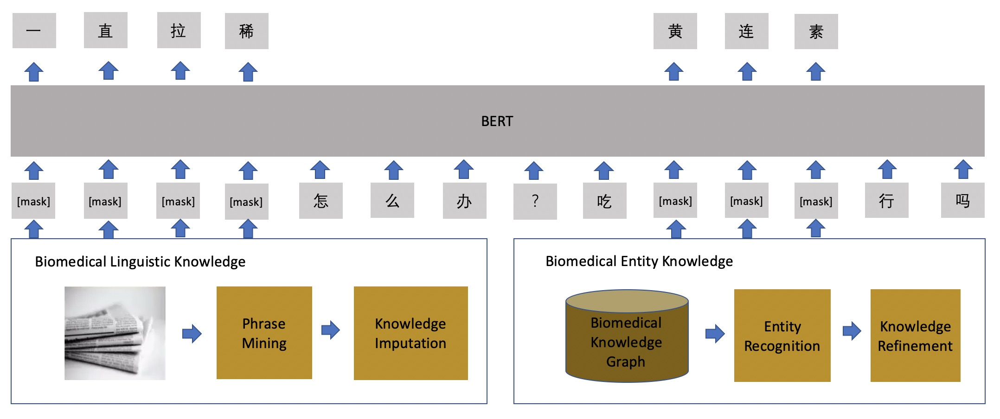

# ChineseBLUE, the Chinese Biomedical Language Understanding Evaluation benchmark
 
Work in progress

## Introduction

ChinesseBLUE benchmark consists of  different biomedicine text-mining tasks with  corpora.
These tasks cover a diverse range of text genres (biomedical web data and clinical notes), dataset sizes, and degrees of difficulty and, more importantly, highlight common biomedicine text-mining challenges.

C-BERT is a novel conceptualized representation learning approach. First, we use a different mask generation procedure to mask spans of tokens, rather than only random ones. We also introduce two kinds of masking strategies, namely whole entity masking and whole span masking.  Finally, C-BERT split the input document into segments based on the actual "sentences" provided by the user as positive samples and sample random sentences from other documents as negative samples for the next sentence prediction.  




## Tasks

| Dataset          | Train |  Dev | Test | Task                    | Metrics             | Domain     |
|-----------------|------:|-----:|-----:|-------------------------|---------------------|------------|
| cEHRNER*        |  800  |  100  | 100  | Name Entity Recognition    | F1             | Clinical   |
| [cMedQANER](data/cMedQANER/cMedQANER.tar.gz)          |  800  | 100   | 100  | Name Entity Recognition    | F1             | Medical   |
| cMedQQ*        | 20K   | 5K   | 5K  | Paraphrase Identification   | F1             | Medical   |
| [cMedQNLI](data/cMedQANER/cMedQNLI.tar.gz)        |  80K  |  10K  |10K   | Question Natural Language Inference  | F1             | Medical   |
| [cMedQA](data/cMedQANER/cMedSQA.tar.gz)       | 10K   | 2K   | 2K  | Question Answering    | F1             |Medical    |
| [cMedIR](data/cMedQANER/cMedIR.tar.gz)       |  80K  |  10K  | 10K  | Information Rerival    |     MRR       |Medical    |
| [cMedIC](data/cMedQANER/cMedIC.tar.gz)       |  1000  |  200  | 200  |  Intent Classification   |        F1      | Medical   |
| [cMedTC]*       | 20K   | 1K   | 1K  |  Sentence Classification   |       F1       | Medical   |

** Those dataset are not public available now because of privcy issues and will be released as soon as possible. 

 
### Named Entity Recognition (NER) 

Name entity recoginition aims to recognize various entities, including diseases, drugs, syndromes, etc.   The cEHRNER dataset labeled from the Chinese electronic health records and the cMedQANER dataset labeled from Chinese community question answering is chosen.

'''
'''

'''
'''
### Paraphrase Identification (PI)

Paraphrase Identification aims to identify whether two sentences express the same meaning. We use cMedQQ, which consists of search query pairs. 

'''
'''
 
### Question Answering (QA)

Question answering   can be approximated as ranking candidate answer sentences based on their similarity. We assign 0,1 labels to the QA pairs, which convert to the binary classification problem. We use cMedQA, which consists of long answers and cMedSQA, which consists of short answers.

'''
'''

### Information  Retrieval (IR)

Information retrival  aims to retrieve most related documents given search queries. IR can be regarded as a ranking task.   We use the cMedIR dataset,  which consists of queries with multiple documents and their relative scores. 
'''
'''

### Intent Classification (IC)

Intent classification aims to assign intent labels to the queries, which can be regarded as multiple label classification tasks. We use the cMedIC dataset, which consists of queries with three intent labels (e.g., no intention, weak intention, and firm intention).
'''
'''

### Text Classification (TC)

Text classification aims to assign multiple labels to the sentence. We use the cMedTC dataset, which consists of biomedical texts with multiple labels.
'''
'''

### Relation extraction (RE)
To be come soon. 

### Text  Summarization 
To be come soon. 

### Machine Reading Comprehension (MRC)
To be come soon. 

### Datasets

All datasets can be downloaded at [ChineseBLUE1.0](data/ChineseBLUE.tar.gz)

### Pretrained Model

All pretrained model can be downloaded at [C-BERT](). 

## Citing Chinese BLUE

*  Ningyu Zhang, Qianghuai Jia, Kangping Yin, Liang Dong, Feng Gao, Nengwei Hua. [Conceptualized Representation Learning for ChineseBiomedical Text]()

```
@InProceedings{zhang2019cbert,
  author    = {Ningyu Zhang, Qianghuai Jia, Kangping Yin, Liang Dong, Feng Gao, Nengwei Hua},
  title     = {Conceptualized Representation Learning for ChineseBiomedical Text},
  booktitle = {},
  year      = {2019},
}
```

## Acknowledgments

We are also grateful to the authors of BERT to make the data and codes publicly available. 

## Disclaimer
This project is not the official product of Alibaba. The information produced on this website is not intended for direct diagnostic use or medical decision-making without review and oversight by a clinical professional. Individuals should not change their health behavior solely on the basis of information produced on this website.   If you have questions about the information produced on this website, please see a health care professional. 

The experimental results presented in the technical report only indicate the performance under the specific data set and super-parameter combination, and do not represent the essence of each model. The experimental results may change due to random number seeds and computing devices. The content of this project is for technical research purposes only and is not intended to be a conclusive basis. The user may use the model arbitrarily within the scope of the license, but we are not responsible for any direct or indirect damages resulting from the use of the content of the project.
